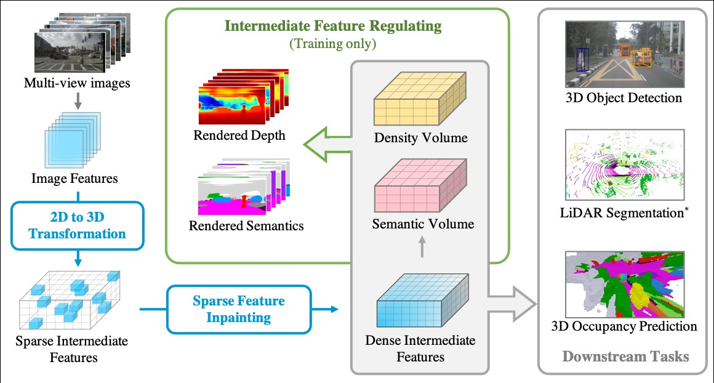

# (AAAI2024) Regulating Intermediate 3D Features for Vision-Centric Autonomous Driving
## Introduction
This is the official pytorch implementation of Regulating Intermediate 3D Features for Vision-Centric Autonomous Driving, In AAAI'24, Junkai Xu, Liang Peng, Haoran Cheng, Linxuan Xia, Qi Zhou, Dan Deng, Wei Qian, Wenxiao Wang and Deng Cai.

## News
- [2023-12-9] Vampire is accepted at AAAI 2024!! Code is comming soon.

## Demo
